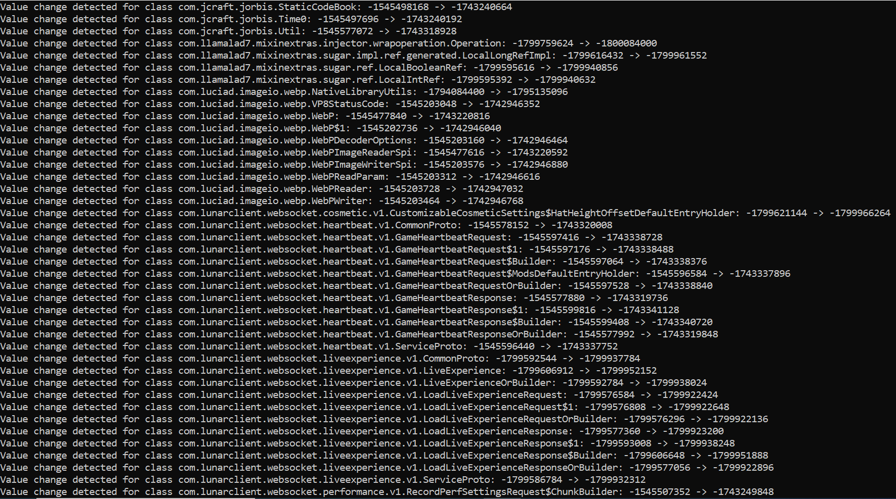
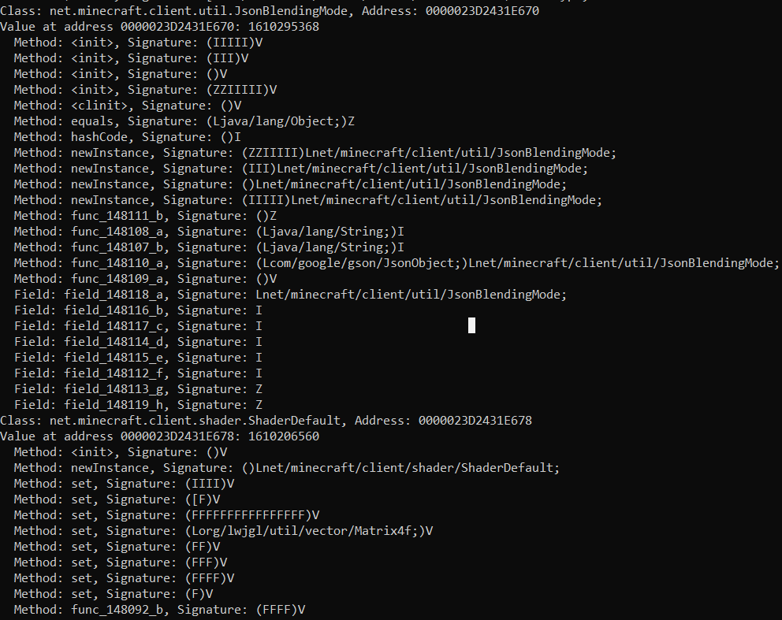

Internal module designed for debugging and analyzing JVM memory.

# Usage

1.) Start your Java program and wait for it to finish loading completely

2.) Inject the JNI module with any DLL Injector

3.) When injected into a process running inside a Java virtual machine, the module will ask you if you want to:

1. Monitor the JVM memory, which will:
   
   1.1 Monitor and detect classes that were modified in memory infinitely
   
   1.2 Print old memory values in negative decimal representation and new (current) memory values
   
   1.3 Stop the monitoring process and print every loaded class that were not modified after pressing the DELETE key
  
 

   2. Analyze the memory of the JVM internally, which will:
   
   2.1 Detect loaded classes in memory
   
   2.2 Detect loaded methods in memory
   
   2.3 Detect loaded fields in memory
   
   2.4 Detect loaded signatures in memory
   
   2.5 Locate the memory locations of each loaded class in the JVM virtual space
   
   2.6 Read the memory contents of each loaded class
   
   *The module will ask you if you want to analyze specific names of a class, a method or a field*

 


**Note 1:** In every program with an allocated console, closing it it's effectively the same as sending a Cntl + C command input to the window, and therefore closing the Java program where the module is injected

**Note 2:** Interacting with the Java program when the internal module is monitoring the memory might crash the program

# Features

> **__1.__** Interact with the JVM memory internally

> **__2.__** Retrieve every loaded class

> **__3.__** Retrieve every loaded method associated with each class

> **__4.__** Retrieve every loaded field associated with each class (to get only static fields, check the dllmain header)

> **__5.__** Retrieve the module base memory address where the Java Virtual Machine is located (optional, only when interacting with the JVM externally)

> **__6.__** Locate every memory address of every loaded class

> **__7.__** Read the process heap segments where these loaded classes are located

> **__8.__** Monitor for memory changes in each class allocated by the JVM

> **__9.__** Redirect Java program's output to the allocated console

> **__10.__** Custom library to interact with the JVM memory externally

```
By default, the program compiles as a dll that uses the Java Native Interface to analyze the loaded classes, without using the files in the JVM folder.
To interact with the JVM externally, you will need to use the custom library I made in the JVM folder, which is a better implementation of the jimmy library.
The offsets I used to retrieve the internal memory layouts were reverse engineered for the JVM V1_2 version, which its not the same as my internal implementation (V1_1).
This means that if you attempt to get a class object with the internal component, you will use an invalid seed and you won't be able to get the system class or any symbol.
```